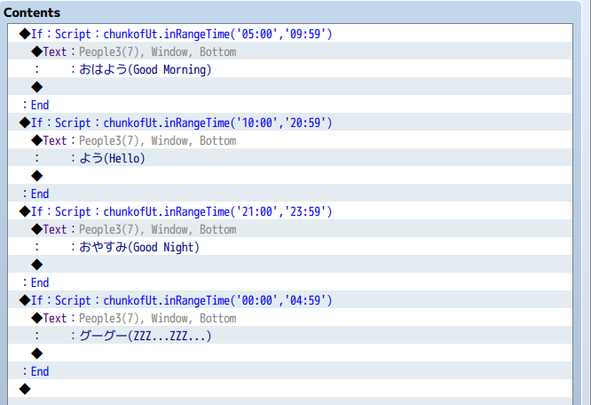
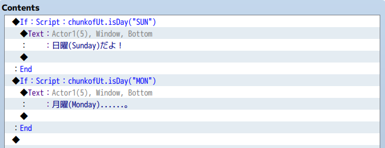

# chunkofUtility.js

ユーティリティ関数群です。

RPGツクールMVのプラグインとして読み込むと後述のユーティリティ関数が使えるようになります。

「イベント分岐条件」として使うことを想定た関数群です。
姫HimeWorksさんの[Custom Page Conditions MV](http://himeworks.com/2015/10/custom-page-conditions-mv/)
と併せて使うことで「イベント出現条件」としても使えます。

関数は、グローバル変数"chunkofUt"を通して使用します。

---
## inRangeTime (時刻のチェック)

現在時間が指定範囲内であればtrueを返す関数です。

時間は'hh:mm'のフォーマットで指定します。

### Usage

```
chunkofUt.inRangeTime('11:00','20:59');

//10:59のとき = false
//11:00のとき = true
//20:59のとき = true
//21:00のとき = false
```

### Sample



---
## isDay (曜日のチェック)

現在が指定の曜日であればtrueを返す関数です。

曜日は以下のどのフォーマットでも指定可能です。

'Mon'
'MON'
'Monday'
'月'
'月曜'

### Usage

```
chunkofUt.isDay('MON')
```

### Sample



---
## イベントの出現条件 として使う

姫HimeWorksさんの[Custom Page Conditions MV](http://himeworks.com/2015/10/custom-page-conditions-mv/)
と併せて使うことで、イベントの出現条件としても使えます。

### Sample


