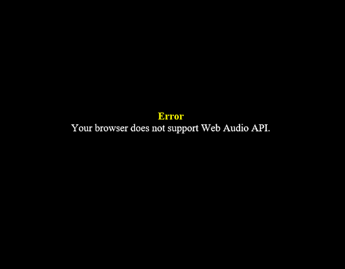
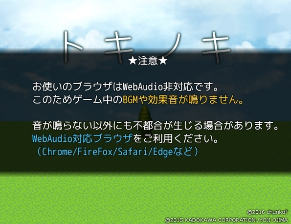

# chunkof_AudioAlert.js

WebAudio非対応ブラウザで開かれた場合「警告表示」「音声なしでプレイ続行」を行います。

## ライセンス：MIT

ソース内の「@author chunkof」を残しておいてもらえれば、利用、改変、再配布は自由です。

## 導入例
http://chunkof.github.io/tokinoki/

## IEで開いた場合

### プラグイン導入前

### プラグイン導入後

