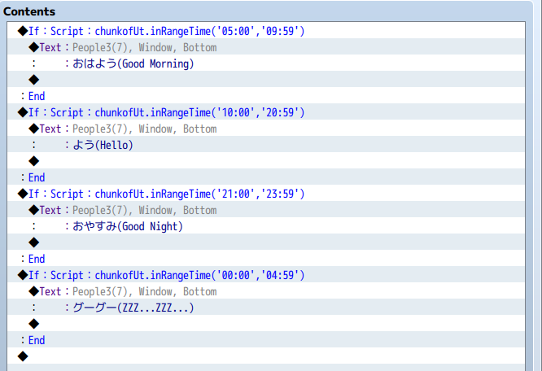
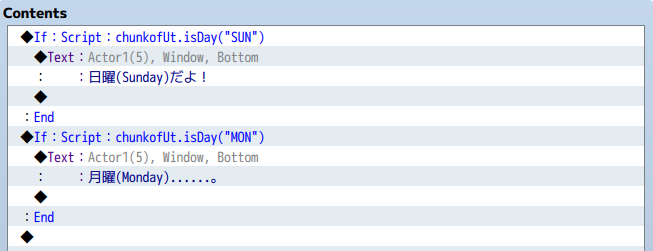
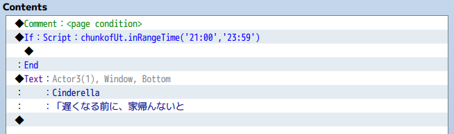

# chunkof_Utility.js

ユーティリティ関数群。

RPGツクールMVのプラグインとして読み込むと後述のユーティリティ関数が使えるようになります。

**「イベント分岐条件」** として使うことを想定した関数群です。
HimeWorksさんの[Custom Page Conditions MV](http://himeworks.com/2015/10/custom-page-conditions-mv/)
と併せて使うことで **「イベント出現条件」** としても使えます。

 関数は、**グローバル変数"chunkofUt"を通して使用します。**

 * [inRangeTime 時刻のチェック](#inRangeTime)
 * [isDay 曜日のチェック](#isDay)
 * [イベントの出現条件 として使う](#as_page_condition)


---
<a id="inRangeTime"></a>
## inRangeTime 時刻のチェック

現在時間が指定範囲内であればtrueを返す関数です。

時間は'hh:mm'のフォーマットで指定します。

### Usage

```
chunkofUt.inRangeTime('11:00','20:59');

//10:59のとき = false
//11:00のとき = true
//20:59のとき = true
//21:00のとき = false
```

### Sample



---
<a id="isDay"></a>
## isDay 曜日のチェック

現在が指定の曜日であればtrueを返す関数です。

曜日は以下のどのフォーマットでも指定可能です。

'Mon'
'MON'
'Monday'
'月'
'月曜'

### Usage

```
chunkofUt.isDay('MON')
```

### Sample



---
<a id="as_page_condition"></a>
## イベントの出現条件 として使う

HimeWorksさんの[Custom Page Conditions MV](http://himeworks.com/2015/10/custom-page-conditions-mv/)
と併せて使うことで、イベントの出現条件としても使えます。

### Sample
21:00～23:59の間だけ出現するイベント。


